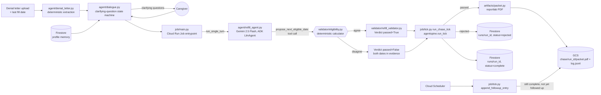

# Architecture: Refill

**Status:** Every component below is implemented and unit-tested (73 tests,
offline; the ADK agent's model-generation call is stubbed in
`tests/test_job_main.py`, but the tool closure it calls -- the calculator
adjudication -- is real, unstubbed code). `job/main.py`'s chase path now
calls the real ADK `LlmAgent` (see "Job entrypoint wiring" below); a live
Gemini call was not exercised in this environment (no `GOOGLE_API_KEY` set
here), only the "fails loudly with no key" branch. Cloud deploy scripts
(`infra/`) are written but pending a live end-to-end run; see
`LIMITATIONS.md`.



## Components and where they live

| Component | Path | What it is |
|---|---|---|
| Eligibility calculator | `validator/eligibility.py` | Pure function `compute_next_eligible(last_fill_date, days_supply, plan) -> EligibilityResult`. No model call. Raises `EligibilityError` rather than guessing on missing `days_supply`. 22 unit tests including leap year, zero early days, missing days_supply. |
| Discrepancy validator | `validator/refill_validator.py` | `EligibilityValidator`, an `agentspine.Validator`. Compares `context["model_claimed_date"]` to the calculator's result. Passes if they agree or the model made no claim yet; fails with both dates in `evidence` on disagreement. |
| Denial letter parser | `agent/denial_letter.py` | Deterministic regex extraction of medication, NDC, plan, denial reason, last fill date, days supply. Missing fields stay `None` and drive clarifying questions rather than guesses. |
| Dialogue state machine | `agent/dialogue.py` | `DialogueSession`: deterministic tracking of which required fields (`plan`, `days_supply`, `last_fill_date`) and optional fields (`prior_attempts`) are still unknown, with priority-ordered questioning and memory prefill. |
| ADK dialogue agent | `agent/refill_agent.py` | Gemini 2.5 Flash `LlmAgent` with `propose_next_eligible_date` bound in as a `FunctionTool`. The tool runs the real calculator and returns AGREE/DISAGREE; the model's instruction forbids arguing past a DISAGREE. |
| Live agent runner | `agent/run_chat.py` | Runs that `LlmAgent` against the real Gemini API through an ADK `InMemoryRunner`. `run_single_turn(prompt, user_id, proposal_log)` is the shared entrypoint: `main()` here is the interactive CLI, and `job/main.py`'s chase path (below) calls the same function. `require_api_key()` raises `SystemExit` naming the missing env var if neither `GOOGLE_API_KEY` nor `GEMINI_API_KEY` is set -- no offline fallback. |
| Job entrypoint wiring | `job/main.py` | `_run_dialogue_agent` calls `require_api_key()` then `run_single_turn` for one turn on the chase's fields (medication, last fill date, days supply, plan, denial reason), parses the model's `model_claimed_date` out of the `propose_next_eligible_date` tool's log, and passes it into `ChaseInput.model_claimed_date` before calling `run_chase_tick`. This is the fix for the gap the Aug 31 judge panel flagged: previously chase mode read `REFILL_MODEL_CLAIMED_DATE` straight into the validator with zero model involvement on the deployed path. `tests/test_job_main.py::test_job_main_chase_invokes_the_real_adk_agent` asserts `_run_dialogue_agent(` appears in `main`'s source, so this can't silently regress. |
| Job runner | `job/tick.py` | `run_chase_tick` wires `EligibilityValidator` + the packet writer through `agentspine.run_tick`. `append_followup_entry` is the later Scheduler tick: appends a second, genuinely time-delayed `log.jsonl` entry, idempotently. Makes no model call itself; `model_claimed_date` on the `ChaseInput` it receives is set by the caller. |
| Profile memory | `memory/profile.py` | `MemoryService` (in-memory for tests, `FirestoreMemoryService` for real), keyed by `user_id::plan`. `remember_fact`, `correct_fact`, and `forget_fact` (explicit deletion, audit trail preserved but excluded from `active_facts`). |
| Packet + log writer | `artifacts/packet.py` | Renders the one-page `packet.pdf` (reportlab): medication, NDC, plan, last fill, days supply, **calculator-derived** next eligible date, denial reason, phone script. |

## Why the validator has veto power

`agentspine.run_tick()` (`agentspine/job.py`, vendored in this repo) calls
`validator.verdict(context)` and only calls `artifact_fn` when
`verdict.passed` is true; on a failed verdict it calls
`backend.mark_rejected()` and returns without writing anything. Wired with
`EligibilityValidator`, a model-claimed date that disagrees with the
calculator makes `verdict()` return `passed=False`, so no packet is ever
produced for that run.

**Proof, not assertion:** see `RED_GREEN.md` for the recorded observation of
bypassing the veto (a wrong date reaches a real packet.pdf) and restoring it
(the same disagreement is rejected, zero artifacts).

## Why background execution matters here

`append_followup_entry` reuses the same idempotency backend as the chase
tick's `run_tick()` call, but runs as a separate, later invocation (a
Scheduler-fired tick). It appends a second `log.jsonl` entry with a
genuinely later timestamp, and is idempotent: calling it twice on the same
run does not duplicate the entry (`tests/test_job_tick.py::TestFollowupTick`).

## Memory correctness (the ADK `add_session_to_memory` LRO bug)

`MemoryService.remember_fact` writes synchronously (a plain Firestore
`set()`, not ADK's `add_session_to_memory`), so there is no extraction LRO
to race, `active_facts()` called immediately after is guaranteed to see
the write. See the docstring in `memory/profile.py` for the full reasoning;
this sidesteps DESIGN.md's named ADK limit by construction.

## State model

Firestore collections (via `agentspine.FirestoreBackend` and
`memory.profile.FirestoreMemoryService`):

```
runs/{run_id}
  status: claimed | rejected | complete
  subject, window_start, window_end
  validator_verdict: {passed, reason, evidence: {calculator_date, model_claimed_date, ...}}
  artifact_uri
  attempts

profiles/{user_id}::{plan}/facts/{key}
  key, value, source, updated_at, deleted: bool
```
